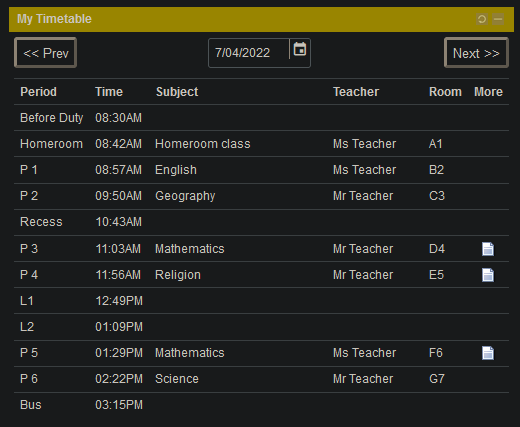
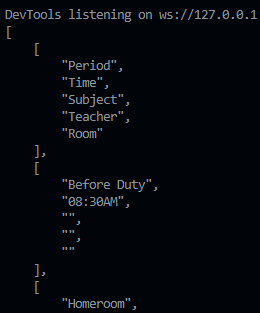

# igloo portal timetable scraper

a headless selenium bot to scrape the timetable of the civica igloo portal  
displays content in JSON format




# documentation

### loading options

to load options ```timetable(username, password, directory to chromedriver)```

or alternatively create a file called **info.py** in the same directory with these contents  
```
def creds():
    return [
            '<username>',
            '<password>',
            '<directory_to_chromedriver>',
           ]
 ```
 and change your code to ```timetable(info.creds()[0], info.creds()[1], info.creds()[2])```
 
 this is to store your credentials
 
 ### running scraper
 
 to scrape the website ```timetable.scrape(options_variable)```
 
 then optionally convert the raw html into json ```timetable.format(raw_html)```
 
 ## example code
```
options = timetable(username, password, directory to chromedriver)

raw_html = timetable.scrape(options)

json_table = timetable.format(raw_html)

print(json_table)
```
